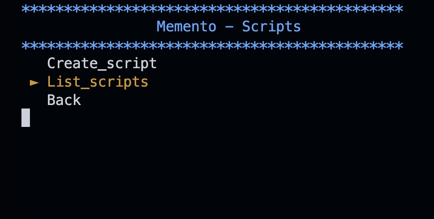

# Memento

Makes it easier to navigate the terminal with 'tagged locations, manages all your scripts and aliases.

## Installation 

*Run Configuration*
```shell
chmod +x setup.sh && ./setup.sh
```

**Note:** 'setup.sh' will create and move the neccesary files for the program to function. (it initialises itself as a script its managing)

## Usage

*demo mode*

If you want to test Memento first, run the script like so:

* Test in interactive mode with:
 ./setup.sh  -ia --demo --skipinstall 
* Test a command:
 ./setup.sh <command> --demo --skipinstall 
 use -h|--help to see the available commands.


### Commands

*Interactive mode*



Start an interactive Memento session, with easy access to all scripts, tags, aliases.

```shell
mto -ia
```


*List all tags, aliases, scripts*

this will print an overview of all items managed within memento to stdout. 

```shell
mto -ls
```

*Help text*
```shell
mto -h
```

### Tags
Tags are callable aliases that move the user to the tagged directory, (no need to remember what lives where in your system)

*Create a tag of the current directory*
```shell
mto -t #will create 't1' (t++), as a callable alias
```
*Labelled tag*
```shell
mto -t project1 #will create 'project1' , as a callable alias
```
*moving to the directory with tagnumber or custom label*
```shell
t1
```
```shell
project1
```

*Remove all tags*
```shell
mto -rta
```

### Scripts
*Move script to scripts directory (can be changed in setup), put it in your shells .rc file, and make it excecutable*
```shell
mto -s scriptfile.sh scriptname
```
*Edit script*
```shell
mto -es scriptfile
```

**Note:** if you want to change some functionality within memento itself, you can use this memento edit it;
```shell
mto -es mto_memento.sh
```

*Remove script*
```shell
mto -rs scriptfile
```


### Aliases
*Create alias*
```shell
mto -a aliasname 'alias command'
```
*Remove Alias*
```shell
mto -ra aliasname
```
*Remove all alisases*
```shell
mto -rma
```
### Uninstall
*Remove Memento*
```shell
mto -rmto
```


